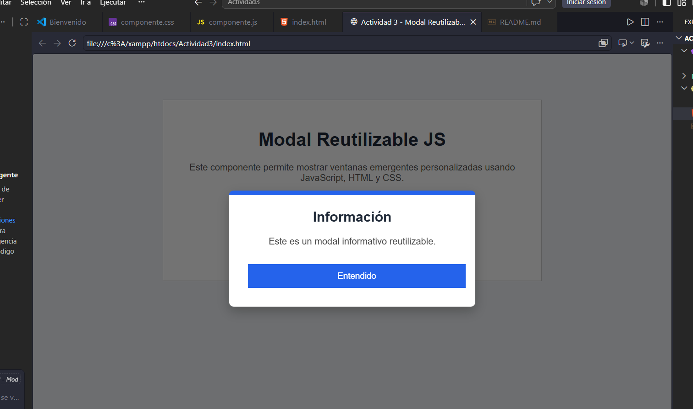
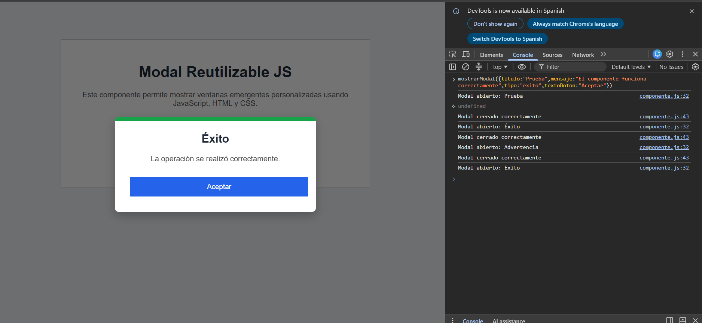

# Actividad 3 - Modal Reutilizable JS

## Portada

**Nombre:** Edsai Alejandro García Reyes  
**Materia:** Programación Web  
**Componente:** Modal Reutilizable JS  

## ¿Qué problema resuelve?

Este componente resuelve el problema de mostrar mensajes importantes al usuario mediante una ventana emergente reutilizable.

En lugar de crear un modal diferente para cada mensaje, este componente permite generar modales personalizados usando parámetros como título, mensaje, tipo y texto del botón.

El componente puede utilizarse para mostrar mensajes informativos, advertencias o confirmaciones de éxito dentro de cualquier página web.

---

## Instalación

Para utilizar el componente se deben enlazar los archivos CSS y JavaScript dentro del HTML.

```html
<link rel="stylesheet" href="css/componente.css">
<script src="js/componente.js"></script>
```

---

## Uso con ejemplos de código

### Modal informativo

```html
<button onclick="mostrarModal({
    titulo: 'Información',
    mensaje: 'Este es un modal informativo reutilizable.',
    tipo: 'info',
    textoBoton: 'Entendido'
})">
    Abrir modal informativo
</button>
```

### Modal de advertencia

```html
<button onclick="mostrarModal({
    titulo: 'Advertencia',
    mensaje: 'Debes revisar los datos antes de continuar.',
    tipo: 'advertencia',
    textoBoton: 'Revisar'
})">
    Abrir modal de advertencia
</button>
```

### Modal de éxito

```html
<button onclick="mostrarModal({
    titulo: 'Éxito',
    mensaje: 'La operación se realizó correctamente.',
    tipo: 'exito',
    textoBoton: 'Aceptar'
})">
    Abrir modal de éxito
</button>
```

---

## Funciones principales

### mostrarModal(opciones)

Esta función crea y muestra un modal en pantalla. Recibe un objeto con las opciones del modal.

```javascript
mostrarModal({
    titulo: "Mensaje",
    mensaje: "Contenido del modal",
    tipo: "info",
    textoBoton: "Cerrar"
});
```

### cerrarModal()

Esta función cierra el modal activo.

```javascript
cerrarModal();
```

---

## Capturas de pantalla

### Modal funcionando



### Consola mostrando resultados


Enlace del video:

---

## Conclusión

Esta actividad permitió crear un componente visual interactivo utilizando HTML, CSS y JavaScript puro, sin frameworks.

El componente desarrollado es reutilizable porque puede mostrar diferentes mensajes modificando sus parámetros. Además, permite mejorar la experiencia del usuario al presentar información importante mediante ventanas emergentes claras y fáciles de usar.
